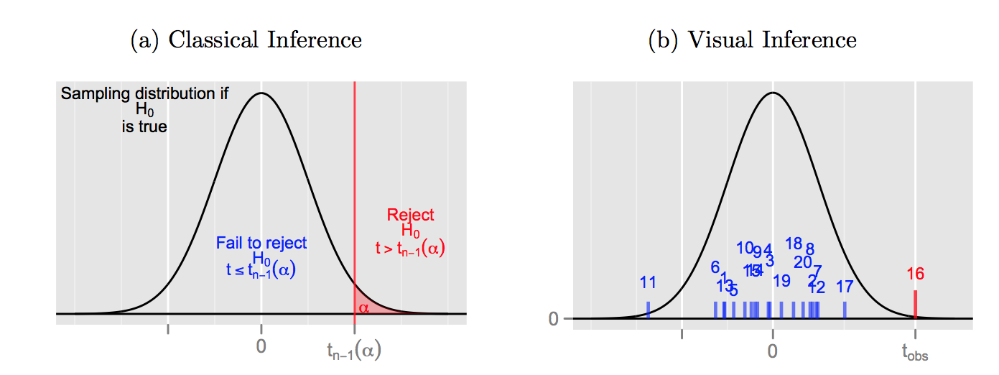

```{r, echo = FALSE, message = FALSE, warning = FALSE, warning = FALSE}
knitr::opts_chunk$set(
  message = FALSE,
  warning = FALSE,
  error = FALSE, 
  echo = FALSE, 
  collapse = TRUE,
  comment = "",
  fig.height = 5,
  fig.width = 8,
  fig.align = "center",
  cache = FALSE
)
```

```{r}
library(tidyverse)
library(gridExtra)
library(plotly)
library(ggthemes)
library(ggmap)
library(lubridate)
#devtools::install_github("dicook/nullabor")
library(nullabor)
library(HLMdiag)
```

# Overview

- Grammar of graphics
    + Language of defining plots, that integrates with statistical thinking
    + Way to say how one plot is the same or different from another, e.g. barchart v pie chart
    + Evaluate whether one design is better than another for communication
- Inference for graphics
- Graphical principles 


---
class: inverse middle 
# Your turn

- What is a (data) plot?
- What are the three most important data plots?

---
class: inverse middle 
# Your turn

How would you describe this plot?

```{r}
music <- read.csv("data/music-sub.csv", 
                  row.names=1, stringsAsFactors = FALSE)
ggplot(music, aes(x=lvar, y=lave, colour=artist)) + geom_point() +
  xlab("Variance amplitude") + ylab("Average amplitude") +
  theme(aspect.ratio=1)
```

---
class: inverse middle 
# Your turn

What about this plot?

```{r}
ggplot(music, aes(x=lvar, y=lave, shape=artist)) + geom_point() +
  xlab("Variance amplitude") + ylab("Average amplitude") +
  scale_shape_manual(values=c("Abba"=1, "Beatles"=2, "Beethoven"=3, 
                     "Eels"=4, "Enya"=5, "Mozart"=6, "Vivaldi"=7)) +
  theme(aspect.ratio=1)
```

---
# Elements of a data plot

- data
- mapping of variables to graphical elements (aesthetics)
- type of plot structure to use (geom)
- transformations: log scale, ...

and ...

- layers: multiple geoms, multiple data sets, annotation
- facets: show subsets in different plots
- themes: modifying style

---
# Why use a grammar of graphics?

- Remember tidy data?
- Data is organised into variables and observations. 
- With a grammar, the variables are directly mapped to an element in the plot 

---
# Tuberculosis data

```{r}
tb <- read_csv("data/tb.csv")
tidy_data <- tb %>% 
  gather(demo, count, -year, -iso2, na.rm = TRUE) %>% 
  separate(demo, c("gender", "age"))
tidy_data <- tidy_data %>% 
  filter(!(age %in% c("014", "04", "514", "u")))
tb_au <- tidy_data %>% 
  filter(iso2 == "AU")
```

```{r echo=TRUE, fig.width=12, fig.height=2.5}
ggplot(tb_au, aes(x = year, y = count, fill = gender)) +
  geom_bar(stat = "identity", position = "fill") +
  facet_grid(~ age) +
  scale_fill_brewer(palette="Dark2")
```

100% charts? What so we learn?

---
# Bar charts

```{r echo=TRUE, fig.width=12, fig.height=2.5}
ggplot(tb_au, aes(x = year, y = count, fill = gender)) +
  geom_bar(stat = "identity") +
  facet_grid(~ age) +
  scale_fill_brewer(palette="Dark2")
```

What do we learn?

---
# Side-by-side barcharts

```{r echo=TRUE, fig.width=12, fig.height=2.5}
ggplot(tb_au, aes(x = year, y = count, fill = gender)) +
  geom_bar(stat = "identity", position="dodge") +
  facet_grid(~ age) +
  scale_fill_brewer(palette="Dark2")
```

What is the focus now?

---
# Separate bar charts

```{r echo=TRUE, fig.width=12, fig.height=3.5}
ggplot(tb_au, aes(x = year, y = count, fill = gender)) +
  geom_bar(stat = "identity") +
  facet_grid(gender ~ age) +
  scale_fill_brewer(palette="Dark2")
```

What is the focus now?

---
# Pie charts?

```{r echo=TRUE, fig.width=12, fig.height=3.5}
ggplot(tb_au, aes(x = year, y = count, fill = gender)) +
  geom_bar(stat = "identity") +
  facet_grid(gender ~ age) +
  scale_fill_brewer(palette="Dark2") + coord_polar()
```

Nope! That's a rose chart.

---
# Rainbow charts?

```{r echo=TRUE, fig.width=12, fig.height=3.5}
ggplot(tb_au, aes(x = 1, y = count, fill = factor(year))) +
  geom_bar(stat = "identity", position="fill") +
  facet_grid(gender ~ age) +
  theme(
    axis.text = element_blank(), 
    strip.text = element_text(size = 16), 
    axis.title = element_text(size = 16)
  ) 
```

Its a single stacked bar, in each facet.

---
# Pie charts

```{r echo=TRUE, fig.width=12, fig.height=3.5}
ggplot(tb_au, aes(x = 1, y = count, fill = factor(year))) +
  geom_bar(stat = "identity", position="fill") +
  facet_grid(gender ~ age) +
  theme(
    axis.text = element_blank(), 
    strip.text = element_text(size = 16), 
    axis.title = element_text(size = 16)
  ) + coord_polar(theta="y")
```

---
# Tidy data and random variables

- The concept of tidy data matches elementary statistics
- Tabular form puts variables in columns and observations in rows
- Not all tabular data is in this form
- This is the point of tidy data

$$X = \left[ \begin{array}{rrrr}
           X_1 & X_2 & ... & X_p 
           \end{array} \right] \\
  = \left[ \begin{array}{rrrr}
           X_{11} & X_{12} & ... & X_{1p} \\
           X_{21} & X_{22} & ... & X_{2p} \\
           \vdots & \vdots & \ddots& \vdots \\
           X_{n1} & X_{n2} & ... & X_{np}
           \end{array} \right]$$

- $X_1 \sim N(0,1), ~~X_2 \sim exp(1) ...$

---
# Grammar of graphics and statistics

- A statistic is a function on the values of items in a sample, e.g. for $n$ iid random variates $\bar{X}_1=\sum_{i=1}^n X_{i1}$, $s_1^2=\frac{1}{n-1}\sum_{i=1}^n(X_{i1}-\bar{X}_1)^2$
- We study the behaviour of the statistic over all possible samples of size $n$. 
- The grammar of graphics is the mapping of (random) variables to graphical elements, making plots of data into statistics


---
# Putting plots into an inference framework

- Choice of plot implicitly sets $H_0$, $H_1$
- Generically, we are thinking  $H_0$: no pattern, $H_1$: pattern, but the choice of plot makes this much more explicit

---
# Putting the pieces together

```{r}
df <- data.frame(v1=c(rexp(20), rexp(15, 2)), 
                 v2=c(rep("A", 20), rep("B", 15)))
ggplot(df, aes(x=v2, y=v1, fill=v2)) + 
  geom_boxplot() + 
  scale_fill_brewer(palette="Dark2") +
  coord_flip()
```

---
# Inference

- Question?
- Data, variables
- Mapping
- Null generating mechanism

--
- Question? Is there a difference between the two groups? $H_0$: no difference, $H_1$: difference

--
- Data, variables: Two variables: v1, v2; v2 is categorical

--
- Mapping: x=V2, y=V1, colour=V1, geom=boxplot

--
- Null generating mechanism: permute the values of V1, relative to V2


---
# Clarity

- The null hypothesis is determined based on the plot type
- It is not based on the structure seen in a data set

---
# Lineup

Embed the data plot in a field of null plots

```{r eval=FALSE}
pos <- sample(1:20, 1)
df_null <- lineup(null_permute('v1'), df, pos=pos)
ggplot(df_null, aes(x=v2, y=v1, fill=v2)) + 
  geom_boxplot() +
  scale_fill_brewer(palette="Dark2") +
  facet_wrap(~.sample, ncol=5) + coord_flip()
```

---

Which plot shows the most difference between the groups?

```{r fig.height=7, fig.width=9, echo=FALSE}
pos <- sample(1:20, 1)
df_null <- lineup(null_permute('v1'), df, pos=pos)
ggplot(df_null, aes(x=v2, y=v1, fill=v2)) + 
  geom_boxplot(width=10) +
  scale_fill_brewer(palette="Dark2") +
  facet_wrap(~.sample, ncol=5) + coord_flip()
```

---
# Answer

Data plot is in position `r pos`

---
# Rejection of null



---
# Evaluation

- Computing $p$-values
- Power - signal strength

---
# p-values

Suppose $x$ individuals selected the data plot from a lineup of $m$ plots, shown to $K$ independent observers, then simplistically we can think about the probability of this happening, if the data plot is from the same distribution as the null plots. This yields a binomial formula:

$$P(X\geq x) = \sum_{i=x}^{K} \binom{K}{i} \left(\frac{1}{m}\right)^i\left(\frac{m-1}{m}\right)^{K-i}$$

For $x=4, K=17, m=20$

```{r}
pvisual(4, 17, m=20)
```

---
# Simulation approach

- Scenario I: in each of K evaluations a different data set and a different set of (m-1) null plots is shown.
- Scenario II: in each of K evaluations the same data set but a different set of (m-1) null plots is shown.
- Scenario III: the same lineup, i.e. same data and same set of null plots, is shown to K different observers.


---
# Null-generating mechanisms

- Permutation: randomizing the order of one of the variables breaks association, but keeps marginal distributions the same
- Simulation: from a given distribution, or model. Assumption is that the data comes from that model 


---
# Data - Autism

Repeated measurements (panel data, longitudinal data) for each subject. Need to examine within subject dependence, relative to between subject, and between demographic group.

```{r echo=TRUE}
library(HLMdiag)
data(autism)
glimpse(autism)
```

---
# Plotting points

```{r echo=TRUE}
ggplot(autism, aes(x=age2, y=vsae)) + 
  geom_point()
```


---
# Jittering points

```{r echo=TRUE}
ggplot(autism, aes(x=age2, y=vsae)) + 
  geom_jitter(width=0.3, height=0)
```


---
# Adding lines

```{r echo=TRUE}
ggplot(autism, aes(x=age2, y=vsae)) + 
  geom_point() + geom_line()
```

Not the lines we want!

---
# These are the lines we want

```{r echo=TRUE}
ggplot(autism, aes(x=age2, y=vsae, group=childid)) + 
  geom_point() + geom_line()
```

---
# Too much ink

```{r echo=TRUE}
ggplot(autism, aes(x=age2, y=vsae, group=childid)) + 
  geom_point() + geom_line(alpha=0.1)
```

---
# Log scale y

```{r echo=TRUE}
ggplot(autism, aes(x=age2, y=vsae, group=childid)) + 
  geom_point() + geom_line(alpha=0.2) + scale_y_log10()
```

---
# By diagnosis at age 2 

```{r echo=TRUE}
ggplot(autism, aes(x=age2, y=vsae, group=childid, colour=bestest2)) + 
  geom_point() + 
  scale_colour_brewer(palette="Dark2") +
  geom_line(alpha=0.5) + 
  scale_y_log10()
```

---
# Refine groups

```{r echo=TRUE}
ggplot(autism, aes(x=age2, y=vsae, colour=bestest2)) + 
  geom_point(alpha=0.1) + 
  scale_colour_brewer(palette="Dark2") +
  geom_line(aes(group=childid), alpha=0.1) + 
  geom_smooth(se=F) +
  scale_y_log10() 
```

What do we learn about autism, age, and the diagnosis at age 2?

```{r echo=FALSE, eval=FALSE}
In terms of categorisation into either pdd or autism the vsae score is not distinct, but on average the autism diagnosis 2 year olds have lower scores. There a lot of overlap between this group.
```

---
class: inverse middle 
# Your turn

Make a plot that explores the differences between genders, like this

```{r echo=FALSE}
ggplot(autism, 
       aes(x=age2+2, y=vsae, group=childid, colour=gender)) + 
  geom_point() +
  scale_colour_brewer(palette="Dark2") +
  geom_line() + xlim(c(0, 15)) +
  xlab("Age (in years)") + 
  ylab("Vineland Socialization Age Equivalent")
```


---
# A different look

```{r echo=TRUE}
ggplot(autism, aes(x=age2, y=vsae, colour=bestest2)) + 
  geom_boxplot() + 
  scale_colour_brewer(palette="Dark2") +
  scale_y_log10()
```

That's not what I wanted ....

---
# For each age measured

```{r echo=TRUE}
ggplot(autism, aes(x=factor(age2), y=vsae, colour=bestest2)) + 
  geom_boxplot() + 
  scale_colour_brewer(palette="Dark2") +
  scale_y_log10()
```

---
# Which is better?

```{r echo=TRUE, fig.width=9, fig.height=3}
p1 <- ggplot(autism, aes(x=age2, y=vsae, colour=bestest2)) + 
  geom_point(alpha=0.1) + 
  scale_colour_brewer(palette="Dark2") +
  geom_line(aes(group=childid), alpha=0.1) + 
  geom_smooth(se=F) +
  scale_y_log10() + theme(legend.position="none")
p2 <- ggplot(autism, aes(x=factor(age2), y=vsae, colour=bestest2)) +
  geom_boxplot() + 
  scale_colour_brewer(palette="Dark2") +
  scale_y_log10() + 
  theme(legend.position="none")
grid.arrange(p1, p2, ncol=2)
```


---
class: inverse middle 
# Your turn

For the autism data, think about answering the question "Do the kids who age two test on the autism scale have lower cognitive skills than those classed as pdd?"

- Determine which of the two possible plot designs best helps the reader answer this.
- Determine an appropriate null generating mechanism to test $H_o$: no relationship between age and gender.
- Make a lineup to for each plot design. 
- This may not be easy to do: Show the lineups to several other people, people should only see one. For each plot design
  + Record the number of people selecting the data plot
  + Compute the power for each test, the signal strength of the design

---
# New example - Flying etiquette

[41% Of Fliers Think You’re Rude If You Recline Your Seat](http://fivethirtyeight.com/datalab/airplane-etiquette-recline-seat/)

```{r echo=FALSE}
fly <- read_csv("data/flying-etiquette.csv")
glimpse(fly)
```

---
# Variables

- Mix of categorical and quantitative variables. 
- What mappings are appropriate? 
- Area for counts of categories, 
- side-by-side boxplots for mixed pair. 

---
# Support

```{r echo=TRUE}
ggplot(fly, aes(x=`How often do you travel by plane?`)) + 
  geom_bar() + coord_flip()
```

Categories are not sorted

---
# Sorted categories

```{r echo=TRUE}
fly$`How often do you travel by plane?` <- 
  factor(fly$`How often do you travel by plane?`, levels=c(
    "Never","Once a year or less","Once a month or less",
    "A few times per month","A few times per week","Every day"))
ggplot(fly, aes(x=`How often do you travel by plane?`)) + geom_bar() + coord_flip()
```

---

```{r echo=TRUE}
ggplot(fly, aes(x=`How often do you travel by plane?`, 
                fill=`How often do you travel by plane?`)) + geom_bar() + coord_flip() +
  scale_fill_brewer(palette="Dark2")
```

---
# Filter data

```{r echo=TRUE}
fly_sub <- fly %>% filter(`How often do you travel by plane?` %in% 
                            c("Once a year or less","Once a month or less")) %>%
  filter(!is.na(`Do you ever recline your seat when you fly?`)) %>%
  filter(!is.na(Age)) %>% filter(!is.na(Gender))
```

---
# Recline by height

```{r echo=TRUE}
fly_sub$`Do you ever recline your seat when you fly?` <- factor(
  fly_sub$`Do you ever recline your seat when you fly?`, levels=c(
    "Never","Once in a while","About half the time",
    "Usually","Always"))
ggplot(fly_sub, aes(y=`How tall are you?`, x=`Do you ever recline your seat when you fly?`)) + geom_boxplot() + coord_flip()
```

---
class: inverse middle 
# Your turn

Make a plot to answer the question "Is the proportion of males and females that find it rude to bring a baby on board different?"

```{r echo=FALSE, eval=FALSE}
fly <- read_csv("data/flying-etiquette.csv")
fly$`How often do you travel by plane?` <- 
  factor(fly$`How often do you travel by plane?`, levels=c(
    "Never","Once a year or less","Once a month or less",
    "A few times per month","A few times per week","Every day"))
fly_sub <- fly %>% 
  filter(`How often do you travel by plane?` %in% 
       c("Once a year or less","Once a month or less")) %>%
  filter(!is.na(`Do you ever recline your seat when you fly?`)) %>%
  filter(!is.na(Age)) %>% filter(!is.na(Gender))
ggplot(fly_sub, 
       aes(x=`In general, is itrude to bring a baby on a plane?`)) + 
  geom_bar(mapping=aes(fill=Gender), position="fill") + 
  coord_flip() + scale_fill_brewer(palette="Dark2")
```

---
class: inverse middle 
# Your turn


What is the difference between `colour` and `fill`?

--
- colour is for 0 or 1-dimensional elements, and 

--
- fill is for area (2-d) geoms

---
# Coordinate systems

What does `coord_fixed()` do? What is the difference between this and using `theme(aspect.ratio=...)`?

--
- coord_fixed operates on the raw data values, but 

--
- theme(aspect_ratio=...) works on the plot dimensions


---
# Facets

```{r echo=TRUE}
ggplot(fly_sub, 
       aes(x=`In general, is itrude to bring a baby on a plane?`)) + 
  geom_bar() + coord_flip() + facet_wrap(~Gender) 
```

---
# Facets

```{r echo=TRUE}
fly_sub$Age <- factor(fly_sub$Age, levels=c("18-29","30-44","45-60","> 60"))
ggplot(fly_sub, aes(x=`In general, is itrude to bring a baby on a plane?`)) + 
  geom_bar() + coord_flip() + facet_grid(Age~Gender)
```

---
# Color palettes - default

```{r echo=TRUE}
p <- ggplot(fly_sub, aes(x=`In general, is itrude to bring a baby on a plane?`,
                    fill=Gender)) + 
  geom_bar(position="fill") + coord_flip() + facet_wrap(~Age, ncol=5)
p
```

What do we learn?

---
# Color palettes - brewer

```{r echo=TRUE}
p + scale_fill_brewer(palette="Dark2") 
```

---
# Color blind-proofing

```{r fig.show='hide', echo=TRUE}
library(scales)
library(dichromat)
clrs <- hue_pal()(3)
p + theme(legend.position = "none")
clrs <- dichromat(hue_pal()(3))
p + scale_fill_manual("", values=clrs) + theme(legend.position = "none")
```

---

```{r fig.width=4.5, fig.show='hold', fig.align='default'}
clrs <- hue_pal()(3)
p + theme(legend.position = "none")
clrs <- dichromat(hue_pal()(3))
p + scale_fill_manual("", values=clrs) + theme(legend.position = "none")
```

---
# Perceptual principles

- Hierarchy of mappings: (first) position along an axis - (last) color (Cleveland, 1984; Heer and Bostock, 2009)
- Pre-attentive: Some elements are noticed before you even realise it.
- Color: (pre-attentive) palettes - qualitative, sequential, diverging.
- Proximity: Place elements for primary comparison close together. 
- Change blindness: When focus is interrupted differences may not be noticed.

---
# Hierarchy of mappings

- 1.Position - common scale (BEST)
- 2.Position - nonaligned scale
- 3.Length, direction, angle
- 4.Area
- 5.Volume, curvature
- 6.Shading, color (WORST)

---
# Pre-attentive

Can you find the odd one out?

```{r echo=FALSE}
df <- data.frame(x=runif(100), y=runif(100), cl=sample(c(rep("A", 1), rep("B", 99))))
ggplot(data=df, aes(x, y, shape=cl)) + theme_bw() + 
  geom_point() +
  theme(legend.position="None", aspect.ratio=1)
```

---

Is it easier now?

```{r echo=FALSE}
ggplot(data=df, aes(x, y, colour=cl)) + 
  geom_point() +
  theme_bw() + 
  theme(legend.position="None", aspect.ratio=1)
```


---
# Color palettes

- Qualitative: categorical variables
- Sequential: low to high numeric values
- Diverging: negative to positive values

---

```{r, echo=FALSE, fig.height=7, fig.width=12}
library(RColorBrewer)
display.brewer.all()
```


---
# Proximity

```{r echo=TRUE}
ggplot(fly_sub, aes(x=`In general, is itrude to bring a baby on a plane?`,
                    fill=Gender)) + 
  geom_bar(position="fill") + coord_flip() + facet_wrap(~Age, ncol=5)
```

With this arrangement we can see proportion of gender within each rudeness category, and compare these across age groups.  How could we arrange this differently?


---
# Proximity

```{r echo=TRUE}
ggplot(fly_sub, aes(x=Gender,
   fill=`In general, is itrude to bring a baby on a plane?`)) + 
  geom_bar(position="fill") + coord_flip() + facet_wrap(~Age, ncol=5) +
  theme(legend.position="bottom")
```


What is different about the comparison now?

---
# Another arrangement

```{r echo=TRUE}
ggplot(fly_sub, aes(x=Age,
                    fill=`In general, is itrude to bring a baby on a plane?`)) + 
  geom_bar(position="fill") + coord_flip() + facet_wrap(~Gender, ncol=5) + 
  theme(legend.position="bottom")
```

---
# Themes

The `ggthemes` package has many different styles for the plots. Other packages such as `xkcd`, `skittles`, `wes anderson`, `beyonce`, ....

```{r fig.show='hide', echo=TRUE}
library(xkcd)
ggplot(fly_sub, aes(x=Gender,
                    fill=`In general, is itrude to bring a baby on a plane?`)) + 
  geom_bar(position="fill") + 
  coord_flip() + 
  facet_wrap(~Age, ncol=5) +
  theme_xkcd() + 
  theme(legend.position="bottom")
```


---

```{r}
library(xkcd)
ggplot(fly_sub, aes(x=Gender,
                    fill=`In general, is itrude to bring a baby on a plane?`)) + 
  geom_bar(position="fill") + coord_flip() + facet_wrap(~Age, ncol=5) +
  theme_xkcd() + theme(legend.position="bottom")
```

---
# Summary

- Plotting data is an essential component of initial data analysis, and exploratory data analysis - it typically does not compromise the modeling or classical inference
- Plotting post-analysis is important for diagnosing models
- Not so much important whether you choose a bar chart or pie chart, proximity, appropriate color choices, ordering of categories are far more important
- Plot provide more complex statistic, important in today's data-rich world, and they can be slotted into the inferential framework with technology and social tools like crowd-sourcing

---
# Resources

- Winston Chang (2012) [Cookbook for R](graphics cookbook)
- ggplot2 [Cheat sheet](https://www.rstudio.com/wp-content/uploads/2016/11/ggplot2-cheatsheet-2.1.pdf)
- [ggplot2: Elegant Graphics for Data Analysis, Hadley Wickham](http://ggplot2.org/book/), [web site](http://ggplot2.org)
- Antony Unwin (2014) [Graphical Data Analysis](http://www.gradaanwr.net)
- Naomi Robbins (2013) [Creating More Effective Charts](http://www.nbr-graphs.com)
- [Antony Unwin, Graphical Data Analysis with R](https://www.crcpress.com/Graphical-Data-Analysis-with-R/Unwin/9781498715232)
- Hofmann, H., Follett, L., Majumder, M. and Cook, D. (2012) Graphical Tests for Power Comparison of Competing Designs, http://doi.ieeecomputersociety.org/10.1109/TVCG.2012.230.
- Wickham, H., Cook, D., Hofmann, H. and Buja, A. (2010) Graphical Inference for Infovis,  http://doi.ieeecomputersociety.org/10.1109/TVCG.2010.161. 


---
# Share and share alike

This work is licensed under the Creative Commons Attribution-Noncommercial 3.0 United States License. To view a copy of this license, visit http://creativecommons.org/licenses/by-nc/3.0/us/ or send a letter to Creative Commons, 171 Second Street, Suite 300, San Francisco, California, 94105, USA.
